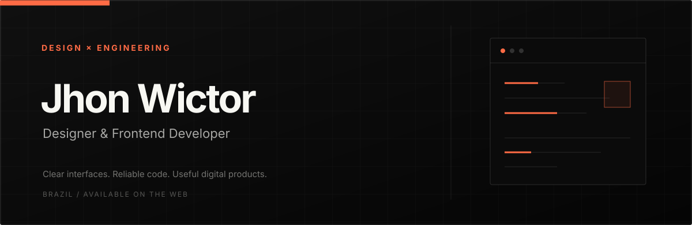
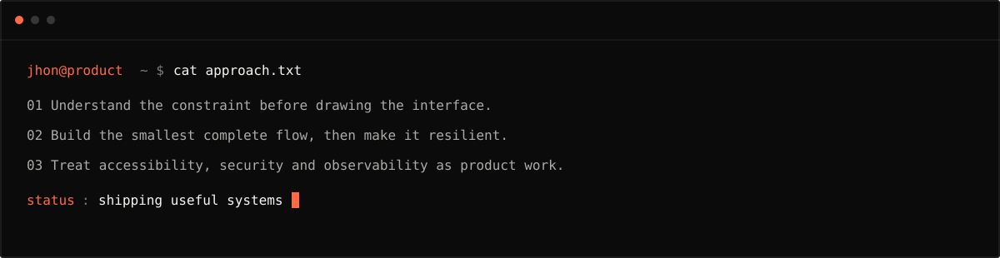
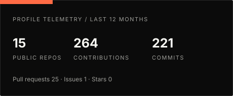
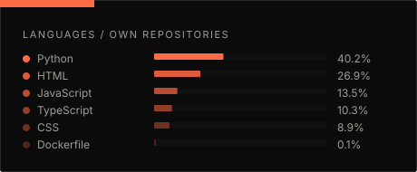
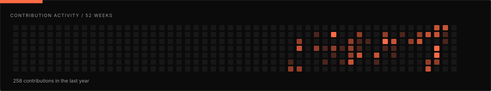
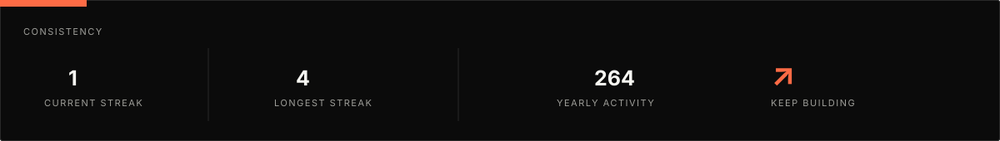

  
   
  

## About

I work at the intersection of **interface design and software development** — from focused conversion pages to the operational products behind them. I care about clear information architecture, maintainable code and experiences that solve a real problem.

- Based in Brazil, building for the web.
- Working across frontend, backend, APIs, automation and product design.
- Current focus: secure multi-tenant systems, integrations and polished interfaces.

## Selected work

<table>
  <tr>
    <td width="50%" valign="top">
      <h3>StockFlow API</h3>
      
Production-oriented inventory API with tenant isolation, RBAC, observability and a real PostgreSQL test suite.

      
<code>FastAPI</code> <code>PostgreSQL</code> <code>SQLAlchemy</code> <code>Docker</code>

      <a href="https://github.com/jhonwictordev/stockflow-api">Repository</a> · <a href="https://jhonwictordev.github.io/stockflow-api/">Live demo</a>
    </td>
    <td width="50%" valign="top">
      <h3>Campaign Platform</h3>
      
Campaign operations platform with granular permissions, isolated data boundaries, contact interactions and reports.

      
<code>Django</code> <code>PostgreSQL</code> <code>Bootstrap</code> <code>Pytest</code>

      <a href="https://github.com/jhonwictordev/plataforma-campanha">Repository</a>
    </td>
  </tr>
  <tr>
    <td width="50%" valign="top">
      <h3>Martins Tech Place</h3>
      
Full-stack commerce experience with authentication, catalog management and Mercado Livre integration.

      
<code>Next.js</code> <code>TypeScript</code> <code>Prisma</code> <code>PostgreSQL</code>

      <a href="https://github.com/jhonwictordev/martins-tech-place">Repository</a>
    </td>
    <td width="50%" valign="top">
      <h3>Portaria360</h3>
      
API-first, multi-tenant PWA for access management with live events, auditability and operational workflows.

      
<code>Node.js</code> <code>REST</code> <code>SSE</code> <code>PWA</code>

      <a href="https://github.com/jhonwictordev/PORTARIA360">Repository</a>
    </td>
  </tr>
  <tr>
    <td width="50%" valign="top">
      <h3>Instagram Prospecting Agent</h3>
      
Human-in-the-loop prospecting workflow with approval gates, contact normalization and safe browser automation.

      
<code>TypeScript</code> <code>n8n</code> <code>Playwright</code> <code>PostgreSQL</code>

      <a href="https://github.com/jhonwictordev/instagram-prospecting-agent">Repository</a>
    </td>
    <td width="50%" valign="top">
      <h3>Wictor Films</h3>
      
A cinematic portfolio focused on visual rhythm, responsive composition and intentional motion.

      
<code>React</code> <code>Vite</code> <code>Tailwind CSS</code> <code>Framer Motion</code>

      <a href="https://github.com/jhonwictordev/wictor-films-site">Repository</a> · <a href="https://wictor-films.netlify.app">Live site</a>
    </td>
  </tr>
</table>

## Toolkit

| Layer | Technologies |
| --- | --- |
| Interface | `HTML` · `CSS` · `JavaScript` · `TypeScript` · `React` · `Next.js` · `Tailwind CSS` · `Vite` |
| Backend | `Node.js` · `Express` · `Python` · `Django` · `FastAPI` · `REST APIs` |
| Data & automation | `PostgreSQL` · `SQLite` · `Prisma` · `SQLAlchemy` · `n8n` · `Playwright` |
| Delivery | `Docker` · `Git` · `GitHub Actions` · `OpenTelemetry` |

## GitHub telemetry

  
  

## Contributions

<picture>
  <source media="(prefers-color-scheme: dark)" srcset="./assets/generated/github-snake-dark.svg" />
  <source media="(prefers-color-scheme: light)" srcset="./assets/generated/github-snake.svg" />
  
</picture>

## Connect

  
  
  

  Designed and built with intent. 
  

